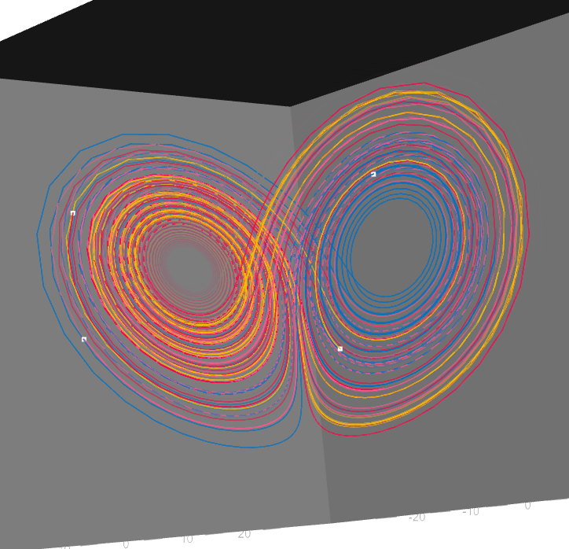

# Animating a path in 3D


I decided to do something in 3D,just so i can create some comfort with
it early, and i decided to go with the rgl package ,then stumbled into
the functions rgl has for animations and i had this idea, why not create
an animation for a [lorenz
attractor](https://en.wikipedia.org/wiki/Lorenz_system) ?

It is a dynamical system that’s really often used when talking about
chaos theory and the butterfly effect (because if you use certain
parameters and look in a certain angle it takes a butterfly shape)



# Lorenz system

I don’t want to go too into detail on this, because my focus is on the
animation paths partd.

it follows this system of equations

$$
\Large \frac{dx}{dt}=\sigma(y-x),
\frac{dy}{dt}=x(\rho-z)-z,
\frac{dz}{dt}=xy-\beta z
$$

And these were the initial conditions used

$$
\Large \Delta t = 0.0001,t_{final}=70,\rho=28,\sigma=10,\beta=\frac{8}{3}
$$

-  `Point 1`
  - $(x_0,y_0,z_0)=(8,5,3)$
-  `Point 2`
  - $(x_0,y_0,z_0)=(3,4,3)$
-  `Point 3`
  - $(x_0,y_0,z_0)=(5,6,2)$
-  `Point 4`
  - $(x_0,y_0,z_0)=(6,4,3)$

You may have noticed that if each step is 0.0001 time units, and it
takes 70 time units of simulation, the resulting dataframe of
coordinates should be 700001 collumns tall, but i actually cut so it
only returns a “new” dataframe with the positions every 200 collumns of
the old one.

# Setting rgl parameters

Honestly i’m still a bit lost on them, i feel like i could use spin3d
here somewhere but i didn’t fully understand how i could do that while
my path animation worked at the same time.

- viewport and windowRect
  - this just resizes the window for the animation to be the proportion
    i want.
- userMatrix
  - this stores the position and rotation of the camera, i used the
    rotate3d function, it just takes one of these rotation/position
    matrices and returns it post rotation.

``` r
returneveryframe <- function()
{
  return(list(viewport=c(0,0,600,600),windowRect=c(800,300,1400,800),userMatrix=rotate3d(par3d()$userMatrix,0.02,0,0,1)))
}
```

# Animation

The rgl package for some reason works with animations in seconds instead
of frames (i know it’s because of the play3d function) so the first
variable to appear has to be that, and then i need to work around it to
make every second transform into frames (which i do in the drawpath
function).

It starts with a plot3d setting up the bounds that i found by trial and
error assisted with both min() and max() functions (There’s also a point
at x=-100 with xlab=“” just so the function runs with nothing onscreen).

bbox3d just colors the background of the xyz space displayed.

returns the returneveryframe function because that’s how rgl functions
made for animation have to work.

``` r
animation <- function(s,...)
{
    plot3d(-100,xlab="",xlim=c(-28,28),ylim=c(-28,28),zlim=c(-3,53))
    bbox3d(col="#aaaaaa")
    
    drawpath(seconds=s,points1,pathcolor=colors[1],...)
    
    drawpath(seconds=s,points2,pathcolor=colors[2],...)
    
    drawpath(seconds=s,points3,pathcolor=colors[3],...)
    
    drawpath(seconds=s,points4,pathcolor=colors[4],...)
    
    return(returneveryframe())
}
```

# Drawing the path

- number_lines
  - It’s the number of lines i want to leave behind in the animation
- total_lines
  - How many collumns of the pos_df i want to work with (that means how
    many lines in the whole animation)
- length
  - Duration of the animation in seconds
- i
  - takes the current time in seconds and calculates what column in the
    pos_df we are
- interval
  - calculates the interval for the last “number_lines” positions up
    until the current one

The alpha parameter in the lines3d function tells the transparency of
the lines, by giving it a vector (with the same length as the amount of
lines) it will display that transparency for each line drawn. So i used
a ReLu activation function (can they even be called that when outside of
neural networks context?), and the -1 is because with n points, you can
make n-1 lines.

``` r
drawpath <- function(seconds,pos_df,pathcolor,number_lines,total_lines,length)
{
  i <- seconds*total_lines/length
  interval <- c(max(1,i-number_lines):i)
  
  lines3d(x=pos_df$x[interval],y=pos_df$y[interval],z=pos_df$z[interval],col=pathcolor,lwd=2,alpha=c(1:(number_lines-1))/(number_lines-1))
  
  points3d(x=pos_df$x[i],y=pos_df$y[i],z=pos_df$z[i],col="white",size=6)
}
```

# Ending

Here’s me making a path animation for a random walk:

``` r
open3d()
movie3d(animation2,fps=10,total_lines = 200,number_lines = 10,length=15,duration=15,type="gif",movie="Random walk",dir = getwd(),webshot = F)
```


